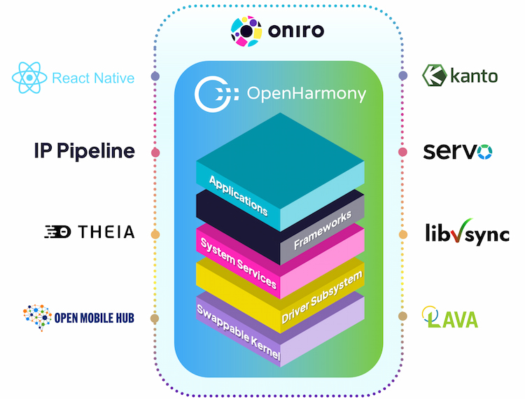
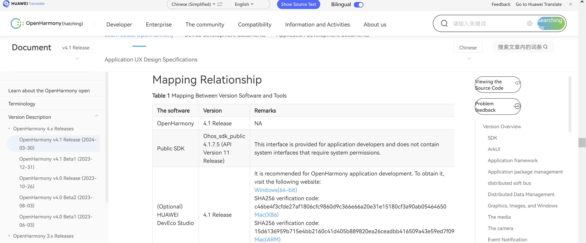

# Oniro Documentation Structure Proposal

current action is to fill the content from different sources, we will investigate and m

Short todo summary:
- Verify source using LICENSE `CC BY 4.0`  -> [Here](https://creativecommons.org/licenses/by/4.0/)
> **Key Points:**  
You are free to  
**Share** — copy and redistribute the material in any medium or format for any purpose, even commercially.  
**Adapt** — remix, transform, and build upon the material for any purpose, even commercially.  
The licensor cannot revoke these freedoms as long as you follow the license terms.  
Under the following terms:  
Attribution — You must give appropriate credit , provide a link to the license, and indicate if changes were made .   
You may do so in any reasonable manner, but not in any way that suggests the licensor endorses you or your use.  
No additional restrictions — You may not apply legal terms or technological measures that legally restrict others from doing anything the license permits.  

- Verify `codeLab` demo source using LICENSE `Apache version 2.0`(If we can simply provide link in our docs and redirect to these demo repos)   
- About `No existing source`, I propose to write this part from scratch  
- About source from `Oniro Docs`, I propose to reuse/(make modification based on original docs)

## [Oniro Project Vision and Aims](https://docs.oniroproject.org/)
### What is Oniro?  

Oniro is an open-source, vendor-neutral Operating System (OS) managed by the Eclipse Foundation. It is built upon the foundational layers of OpenHarmony, an open-source project incubated and operated by the OpenAtom Foundation. OpenHarmony is known for its distributed OS features that cater to a wide range of smart devices, regardless of their size. Oniro extends OpenHarmony code base with add-ons for the European and Global markets, such as ReactNative support, Eclipse Theia based IDE, Servo web engine, and more that are coming.  
Text from: (https://docs.oniroproject.org/)  

### Oniro Vision and Aims  
#### System Positioning    

Oniro Project is an ambitious rethink on how an open source collaborative operating system can be run across a variety of device classes - from small microcontrollers with kilobytes of memory to powerful CPUs driving a phone, laptop or even a data center. The goal of Oniro Project is to evolve a set of builtin system capabilities on top of commodity open source kernels that allows sharing of resources and collaboration across distributed devices of various classes.

The development of these capabilities will happen through an open community project along with other interested parties.

For an end-user, Oniro Project will integrate the multiple, standalone smart devices owned by the user and allow for fast interconnection, capability collaboration, and resource sharing between them. This way, the individual devices can collaborate to provide better context-aware services than if they were operating independently of each other.

For an application developer, Oniro Project will integrate distributed technologies to ease application development across different device classes. Developers will be able to focus on upper-layer service logic and develop richer, collaborative applications more easily.

For device developers, Oniro Project will provide reference software blueprints for the key product verticals that will allow them to focus their time on tailoring the OS to their device’s resource capabilities and service characteristics. These software blueprints will provide best-in-class practices and solutions to keep the devices secure out-of-the-box.

Oniro Project will support APIs in multiple programming languages depending on the constraints of the underlying hardware. Developers will be able to choose from Java, Extensible Markup Language (XML), C/C++, JavaScript (JS), Cascading Style Sheets (CSS), and HarmonyOS Markup Language (HML) to develop applications for Oniro Project.  

#### OpenHarmony Compatibility  
Oniro Project will be OpenHarmony compatible. It will include the services and frameworks required by OpenHarmony specification, and provide the APIs required by OpenHarmony specification, so that you can develop products that can interoperate with other OpenHarmony products and be certified as OpenHarmony compatible.

OpenHarmony compatibility will enable required OpenHarmony features in the kernel layer, system services layer and framework layer, allowing the addition of OpenHarmony compatible applications.

Due to the inherent modularity of the Oniro build system (OpenEmbedded), individual projects will be able to pick and choose from the OpenHarmony compatibility features, allowing to build products with just the parts that are needed.

#### Technical Architecture
Oniro Project has a layered architecture built around the Yocto Project and bitbake build system. The Yocto Project is very popular in the embedded Linux community and provides an excellent platform for developing a highly-customizable, cross-kernel operating system. From bottom to top, Oniro Project consists of the kernel layer, system services layer, framework layer, and application layer. In multi-device development, Yocto provides the capabilities to tweak layers and recipes to remove unnecessary subsystems, functions, or modules as required.

| Layer                  | Aim         |
| -----------            | ----------- |
| Kernal Layer           | Oniro Project will support a multi-kernel design out of the box (Linux kernel and an RTOS such as Zephyr RTOS or LiteOS) so that appropriate OS kernels can be selected for devices with different resource limitations. Over time, a kernel abstraction layer (KAL) will shield differences in kernel implementations and provide the upper layer with basic kernel capabilities, including process and thread management, memory management, file system, network management, and peripheral management.       |
| System Services layer  | The System Services Layer will contain the bulk of the differentiating features of Oniro Project. It will provide a complete set of capabilities essential for Oniro Project to offer services for applications through the framework layer. The system services layer will add the following features over time: • The protocols and primitives that allow devices to discover each other • APIs to allow sharing of computing, storage and other resources • APIs that allow applications to be more context-aware due to collaboration with other devices in the network • APIs to allow applications to expose business logic as abilities that may be integrated into other applications or even used on other devices in the network        |
| Framework Layer        | The Framework layer will provide an SDK to develop Oniro Project applications in multiple languages such as Java, C, C++, and JS depending on the target device class and its HW constraints.        |
| Application Layer      | When completed, the Application layer will host the system and third-party applications. Oniro Project applications will be able to use APIs to expose business logic as abilities that may be utilized inside other applications, thus allowing creation of more integrated experiences on the same device as well as distributed across devices.        |

Text from: (https://oniroproject.readthedocs.io/en/latest/overview/oniroproject-vision.html)

Source from `Oniro Docs`, this part I think we can reuse our original `Oniro docs`

## [Operating System Architecture](https://docs.openharmony.cn/pages/v4.1/en/OpenHarmony-Overview.md)
### Architecture  

The Eclipse Oniro architecture builds on the solid foundations of OpenHarmony, enhancing and expanding its capabilities. All system enhancements are rigorously managed by an **advanced IP toolchain** to ensure compliance throughout the development process. Within this framework:

- **React Native** extends the usability of existing applications and ecosystems on top of OpenHarmony, enabling seamless integration across platforms.
- **Eclipse Kanto** expands Oniro's ecosystem adaptability and scalability by empowering edge devices with advanced IoT functionalities, including seamless cloud connectivity and flexible device management.
- The incorporation of the **Rust language**, particularly for the **Servo web engine**, bolsters the overall system's safety and security.
- **Eclipse Theia** enhances the development workflow, simplifying application creation within the ecosystem.
- **libvsync** improves the performance and reliability of applications that require precise coordination across multiple processes.
Future enhancements will include the integration of **NearLink**, offering an alternative to Wi-Fi and Bluetooth with lower latency and improved connectivity, particularly suited for automotive and industrial environments.

Text from (https://oniroproject.org/)

### Features    
**Hardware collaboration and resource sharing**  
This feature is implemented through the following modules:

- **DSoftBus**
DSoftBus is a unified base for seamless interconnection among devices. It powers OpenHarmony with distributed communication capabilities to quickly discover and connect devices, and efficiently transmit data.

- **Distributed data management**  
Distributed data management leverages DSoftBus to manage application data and user data distributed on different devices. Under such management, user data is no longer bound to a single physical device, and service logic is decoupled from storage. As your applications are running across devices, their data is seamlessly transmitted from one device to another, creating a foundation for a user experience that is smooth and consistent.

- **Distributed Scheduler**  
Distributed Scheduler is designed based on technical features such as DSoftBus, distributed data management, and distributed profile. It builds a unified distributed service management mechanism (including service discovery, synchronization, registration, and invocation), and supports remote startup, remote invocation, binding/unbinding, and migration of applications across devices. This way, your application can select the most suitable device to perform distributed tasks based on the capabilities, locations, running status, and resource usage of different devices, as well as user habits and intentions.

- **Device virtualization**  
A distributed device virtualization platform enables cross-device resource convergence, device management, and data processing so that virtual peripherals can function as capability extensions of smartphones to form a Super Device.

**One-time development for multi-device deployment**

OpenHarmony provides you with the application, ability, and UI frameworks. With these frameworks, you can develop your applications once, and then flexibly deploy them across a broad range of different devices. One-time development for multi-device deployment

Consistent APIs ensure the operational compatibility of applications across devices.

- Adaptation of device capabilities (including CPU, memory, peripheral, and software resources) can be previewed.
- Resources can be scheduled based on the compatibility between applications and the software platform.  

**A unified OS for flexible deployment**

OpenHarmony enables hardware resources to be scaled with its component-based and small-scale designs. It can be deployed on demand for a diverse range of devices, including ARM, RISC-V, and x86 architectures, and providing RAM volumes ranging from hundreds of KiB to GiB.

Text from (https://docs.openharmony.cn/pages/v4.1/en/OpenHarmony-Overview.md)  
>**Note:** need verify the words used in this text like 'OpenHarmony' since we want to emphasize Oniro  

### System Types  

OpenHarmony supports the following system types:

- **Mini system**  
A mini system fits into devices that come with Micro Controller Units (MCUs), such as Arm Cortex-M and 32-bit RISC-V processors, and memory greater than or equal to 128 KiB. This system provides multiple lightweight network protocols, a lightweight graphics framework, and a wide range of read/write components with the IoT bus. Typical products include connection modules, sensors, and wearables for smart home.

- **Small system**  
A small system runs on devices whose memory is greater than or equal to 1 MiB and that are equipped with application processors such as Arm Cortex-A. This system provides higher security capabilities, standard graphics frameworks, and video encoding and decoding capabilities. Typical products include smart home IP cameras, electronic cat eyes, and routers, and event data recorders (EDRs) for easy travel.

- **Standard system**  
A standard system runs on devices whose memory is greater than or equal to 128 MiB and that are equipped with application processors such as Arm Cortex-A. This system provides a complete application framework supporting the enhanced interaction, 3D GPU, hardware composer, diverse components, and rich animations. This system applies to high-end refrigerator displays.

Text from (https://docs.openharmony.cn/pages/v4.1/en/OpenHarmony-Overview.md)  
>**Note:** need verify the words used in this text like 'OpenHarmony' since we want to emphasize Oniro

Source from `OpenHarmony docs` used LICENSE [CC BY 4.0](https://creativecommons.org/licenses/by/4.0/legalcode)  
You can find legal notice about such info [here](https://gitee.com/openharmony/docs/blob/master/en/Legal-Notices.md#https://gitee.com/link?target=https%3A%2F%2Fcreativecommons.org%2Flicenses%2Fby%2F4.0%2Flegalcode)

## Application Development Guide
### Introduction(To be investigated)
- What is this guide for?  
This documentation is designed to guide developers through the process of creating applications on the Oniro/OpenHarmony platform. Whether you're new to the platform or looking to deepen your knowledge, this guide provides a comprehensive overview of the key concepts and tools you'll need.

Text from (https://github.com/frankplus/oh-app-development-docs/tree/master)

- Overview of application development
- Key concept and terminology

### [Development Environment](https://github.com/frankplus/oh-app-development-docs/blob/master/Chapter_3/Dev%20Enviroment%20Setup%20Guide.md)  
As the saying goes, *"If you want to do well, you must first sharpen your tools."* To develop OpenHarmony applications, you need to complete some preparations to ensure that the necessary DevEco Studio development tool, that is, the one-stop integrated development environment (IDE) of OpenHarmony, is ready.

The following describes how to download, install, and configure the development environment by taking the DevEco Studio tool installed in Windows as an example.

#### System requirement
To ensure the proper running of DevEco Studio, it is recommended that the Windows PC meet the following requirements:

- Operating system: Windows 10 64-bit

- Memory: 8 GB or above

- Hard disk: 100 GB or above

- Resolution: 1280 x 800 pixels or higher

#### IDE Installation  
- Download **DevEco Studio**  
On the HarmonyOS [release notes](https://docs.openharmony.cn/pages/v4.1/zh-cn/release-notes/OpenHarmony-v4.1-release.md) (Chinese -- you would need a translator), you can download DevEco studio 4.1 from the following link:  
<https://contentcenter-vali-drcn.dbankcdn.cn/pvt_2/DeveloperAlliance_package_901_9/ee/v3/HqJ-6O2FQny86xtk_dg9HQ/devecostudio-windows-4.1.0.400.zip?HW-CC-KV=V1&HW-CC-Date=20240409T033730Z&HW-CC-Expire=315360000&HW-CC-Sign=BFA444BC43A041331E695AE2CFA9035A957AF107E06C97E793FD3D31D7096A0D>  

**DevEco Studio** provides Windows and Mac versions. You can download DevEco Studio based on the operating system.  
  

#### How to set up environment  

#### [Real device configuration](https://github.com/imansmallapple/ArkTS-simple-demo-usage/blob/main/deveco_device_usage.md)  
- Install HDC  

(This source is from my repo)

The source(Link of `Development Environment`) is from private personal repository

### Your first Eclipse Oniro Application
- [Create a new application](https://docs.openharmony.cn/pages/v4.1/en/application-dev/quick-start/start-with-ets-stage.md)
- [Understanding application package structure](https://docs.openharmony.cn/pages/v4.1/en/application-dev/quick-start/application-package-structure-stage.md)  
- Debugging and troubleshooting (No existing source)  

Source from `OpenHarmony docs`

### [Resource Management](https://docs.openharmony.cn/pages/v4.1/en/application-dev/quick-start/resource-categories-and-access.md)
- Resource categories
- Managing assets & localization

Source from `OpenHarmony docs`

### Application Architecture (No existing source)

### Basic development knowledge
This part is considered to be rewrite, since previous private repo may exist potential copyright issue.

### [Code Labs](https://gitee.com/openharmony/codelabs/blob/master/README.md)
Source from `OpenHarmony gitee repo`, Licensed under the `Apache License, Version 2.0`

### [Api References](https://docs.openharmony.cn/pages/v4.1/en/application-dev/reference/apis-arkts/js-apis-buffer.md)  
Source from `OpenHarmony docs`, about this part we can provide redirect link to `openHarmony docs` so that we needn't rewrite.

### Common Issues(No existing source)

## Device Development
This part of docs I found mostly in `Oniro docs`
### Development Environment

### Supported devices
#### Virtual Device
- QEMU

#### [Boards](https://docs.oniroproject.org/developer-boards/)
- HiHope HH-SCDAYU200  
- Raspberry Pi 4 Model B  

Source from `Oniro docs`

#### Developer Phone

### [Quick build with Oniro](https://docs.oniroproject.org/eclipse-oniro-project/building-oniro.html)
Source from `Oniro docs`

### [Oniro IDE](https://docs.oniroproject.org/oniro-ide/)
Source from `Oniro docs`

## Policies and Compliance
- [Intellectual Property Policy](https://www.eclipse.org/org/documents/Eclipse_IP_Policy.pdf)
- [Security Policies](https://oniroproject.readthedocs.io/en/latest/security/index.html#)

Source from `old oniro docs`

## Community
- Matrix  
## Contact Us
- to be added