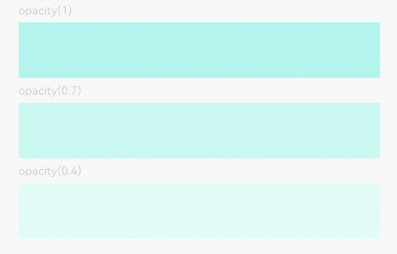

# Opacity


>  **NOTE**
> This attribute is supported since API version 7. Updates will be marked with a superscript to indicate their earliest API version.


The attributes described in this topic are used to set the opacity of a component.


## Required Permissions

None


## Attributes


  | Name | Type | Default Value | Description | 
| -------- | -------- | -------- | -------- |
| opacity | number | 1 | Opacity of a component. The value ranges from **0** to **1**. The value **1** means opaque, and **0** means completely transparent. | 


## Example

  
```
@Entry
@Component
struct OpacityExample {
  build() {
    Column({ space: 5 }) {
      Text('opacity(1)').fontSize(9).width('90%').fontColor(0xCCCCCC)
      Text().width('90%').height(50).opacity(1).backgroundColor(0xAFEEEE)
      Text('opacity(0.7)').fontSize(9).width('90%').fontColor(0xCCCCCC)
      Text().width('90%').height(50).opacity(0.7).backgroundColor(0xAFEEEE)
      Text('opacity(0.4)').fontSize(9).width('90%').fontColor(0xCCCCCC)
      Text().width('90%').height(50).opacity(0.4).backgroundColor(0xAFEEEE)
    }
    .width('100%')
    .padding({ top: 5 })
  }
}
```


