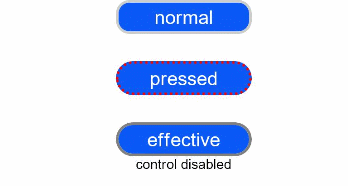

# Polymorphic Style


>  **NOTE**
> This component is supported since API version 8. Updates will be marked with a superscript to indicate their earliest API version.


You can set state-specific styles for components.


## Required Permissions

None


## Attributes

| Name | Type | Default Value | Description |
| -------- | -------- | -------- | -------- |
| stateStyles | StateStyles | - | Styles of a component for different states. |

- StateStyles<sup>8+</sup>
    | Name | Type | Mandatory | Default Value | Description |
  | -------- | -------- | -------- | -------- | -------- |
  | normal | ()=&gt;void | No | - | Style of the component when stateless. |
  | pressed | ()=&gt;void | No | - | Style of the component in the pressed state. |
  | disabled | ()=&gt;void | No | - | Style of the component in disabled state. |


## Example


```
@Entry
@Component
struct StyleExample {
  @State isEnable: boolean = true

  @Styles pressedStyles() {
        .backgroundColor("#ED6F21")
        .borderRadius(10)
        .borderStyle(BorderStyle.Dashed)
        .borderWidth(2)
        .borderColor("#33000000")
        .width(120)
        .height(30)
        .opacity(1)
  }

  @Styles disabledStyles() {
        .backgroundColor("#E5E5E5")
        .borderRadius(10)
        .borderStyle(BorderStyle.Solid)
        .borderWidth(2)
        .borderColor("#2a4c1919")
        .width(90)
        .height(25)
        .opacity(1)
  }

  @Styles normalStyles() {
        .backgroundColor("#0A59F7")
        .borderRadius(10)
        .borderStyle(BorderStyle.Solid)
        .borderWidth(2)
        .borderColor("#33000000")
        .width(100)
        .height(25)
        .opacity(1)
  }

  build() {
    Flex({ direction: FlexDirection.Column, alignItems: ItemAlign.Center }) {
      Text("normal")
        .fontSize(14)
        .fontColor(Color.White)
        .opacity(0.5)
        .stateStyles({
          normal: this.normalStyles,
        })
        .margin({ bottom: 20 })
        .textAlign(TextAlign.Center)
      Text("pressed")
        .backgroundColor("#0A59F7")
        .borderRadius(20)
        .borderStyle(BorderStyle.Dotted)
        .borderWidth(2)
        .borderColor(Color.Red)
        .width(100)
        .height(25)
        .opacity(1)
        .fontSize(14)
        .fontColor(Color.White)
        .stateStyles({
          pressed: this.pressedStyles,
        })
        .margin({ bottom: 20 })
        .textAlign(TextAlign.Center)
      Text(this.isEnable == true ? "effective" : "disabled")
        .backgroundColor("#0A59F7")
        .borderRadius(20)
        .borderStyle(BorderStyle.Solid)
        .borderWidth(2)
        .borderColor(Color.Gray)
        .width(100)
        .height(25)
        .opacity(1)
        .fontSize(14)
        .fontColor(Color.White)
        .enabled(this.isEnable)
        .stateStyles({
          disabled: this.disabledStyles,
        })
        .textAlign(TextAlign.Center)
      Text("control disabled")
        .onClick(() => {
          this.isEnable = !this.isEnable
          console.log(`${this.isEnable}`)
        })
    }
    .width(350).height(300)
  }
}
```


