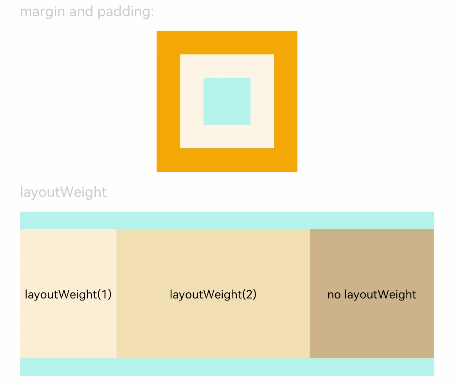

# Size


>  **NOTE**
> This attribute is supported since API version 7. Updates will be marked with a superscript to indicate their earliest API version.


## Required Permissions

None


## Attributes


| Name | Type | Default Value | Description |
| -------- | -------- | -------- | -------- |
| width | Length | - | Width of a component. By default, the width required to fully hold the component content is used. |
| height | Length | - | Height of the component. By default, the height required to fully hold the component content is used. |
| size | {<br/>width?: Length,<br/>height?: Length<br/>} | - | Height and width of the component. |
| padding | {<br/>top?: Length,<br/>right?: Length,<br/>bottom?: Length,<br/>left?: Length<br/>} \| Length | 0 | Padding of the component.<br/>When the parameter is of the **Length** type, the four paddings take effect. |
| margin | {<br/>top?: Length,<br/>right?: Length,<br/>bottom?: Length,<br/>left?: Length<br/>}<br/>\| Length | 0 | Margin of the component. <br/>When the parameter is of the **Length** type, the four margins take effect. |
| constraintSize | {<br/>minWidth?: Length,<br/>maxWidth?: Length,<br/>minHeight?: Length,<br/>maxHeight?: Length<br/>} | {<br/>minWidth: 0,<br/>maxWidth: Infinity,<br/>minHeight: 0,<br/>maxHeight: Infinity<br/>} | Constraint size of the component, which is used to limit the size range during component layout. |
| layoutWeight | number | 0 | Weight of the component during layout. When the container size is determined, the layout of the component and sibling components is allocated based on the weight along the main axis. The component size setting is ignored.<br/>>  **NOTE**<br/>> This attribute is valid only for the **Row**, **Column**, and **Flex** layouts. |


## Example

```
@Entry
@Component
struct SizeExample {
  build() {
    Column({ space: 10 }) {
      Text('margin and padding:').fontSize(12).fontColor(0xCCCCCC).width('90%')
      // The width is 80, the height is 80, the padding is 20, and the margin is 20.
      Row() {
        Row() {
          Row().size({ width: '100%', height: '100%' }).backgroundColor(0xAFEEEE)
        }.width(80).height(80).padding(20).margin(20).backgroundColor(0xFDF5E6)
      }.backgroundColor(0xFFA500)

      Text('layoutWeight').fontSize(12).fontColor(0xCCCCCC).width('90%')
      // When the container size is determined, the layout of the component and slibing components is allocated based on the weight along the main axis. The component size setting is ignored.
      Row() {
        // Weight 1
        Text('layoutWeight(1)')
          .size({ width: '30%', height: 110 }).backgroundColor(0xFFEFD5).textAlign(TextAlign.Center)
          .layoutWeight(1)
       // Weight 0
        Text('layoutWeight(2)')
          .size({ width: '30%', height: 110 }).backgroundColor(0xF5DEB3).textAlign(TextAlign.Center)
          .layoutWeight(2)
        // The default weight is 0.
        Text('no layoutWeight')
          .size({ width: '30%', height: 110 }).backgroundColor(0xD2B48C).textAlign(TextAlign.Center)
      }.size({ width: '90%', height: 140 }).backgroundColor(0xAFEEEE)
    }.width('100%').margin({ top: 5 })
  }}
```


