**Content Table:**  
[Before you begin](#)  

[Create an Eclipse Onrio app using OpenHarmony Template](#create-an-eclipse-onrio-app-using-openharmony-template)  

[Find project files](#find-project-files)    

[Usage of Previewer](#usage-of-previewer)  

[Build the First Page](#build-the-first-page)  
- [Use the `Text` Component](#use-the-text-component)
- [Add a `Button` Component](#use-the-text-component)

[Build the Second Page](#build-the-second-page)  
- [Create the Second Page](#create-the-second-page)  
- [Add `Text` and `Button` Components](#add-text-and-button-components)  

[Implementing Page Redirection](#implementing-page-redirection)  
- [Redirection from the first page to the second page](#redirection-from-the-first-page-to-the-second-page)  
- [Redirection from the second page to the first page](#redirection-from-the-second-page-to-the-first-page)  

[Running the Application on a Real Device](#running-the-application-on-a-real-device)  
- [Install HDC](#install-hdc)  
- [Use real machine to run application with USB](#use-real-machine-to-run-application-with-usb)  

## Before you begin  

Make sure you have gone through the [environment setup guide](/application-development/environment-setup-config.md).  


In this tutorial, you will create your first Eclipse Oniro application with `OpenHarmony` template provided by `DevEco Studio`. 

#### Prerequisites
- Current available version of DevEco Studio installed on your system

#### What you will learn  
- **Set up DevEco Studio**: Installed and configured the necessary environment for application development.
<br>

- **Created a new project**: Used the `[openHarmony]Empty Ability` template to initialize a project.
<br>

- **Explored the project structure**: Navigated different views like Ohos and Project Files to locate and manage files.
<br>

- **Used the Previewer**: Learned how to preview UI updates in real time, switch devices, rotate screens, and inspect components.
<br>

- **Built UI components**: Added Text and Button components to display messages and handle user interactions.
<br>

- **Implemented page navigation**: Used the router module to enable redirection between pages with transition effects.
<br>

- **Deployed on a real device**: Installed HDC, configured device settings, and ran the application on a physical HiHope HH-SCDAYU200 Development Kit.
<br>


#### What you will build
- An application with two pages that support mutual navigation.  

## Create an Eclipse Onrio app using OpenHarmony Template 
To create a project in DevEco Studio:

1. Double-click the DevEco Studio icon to begin.
<div style="text-align:center">
    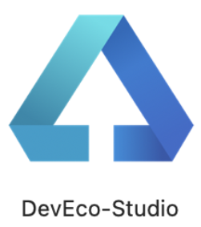
</div>

2. In welcome page click `Create Project`.
<div style="text-align:center">
    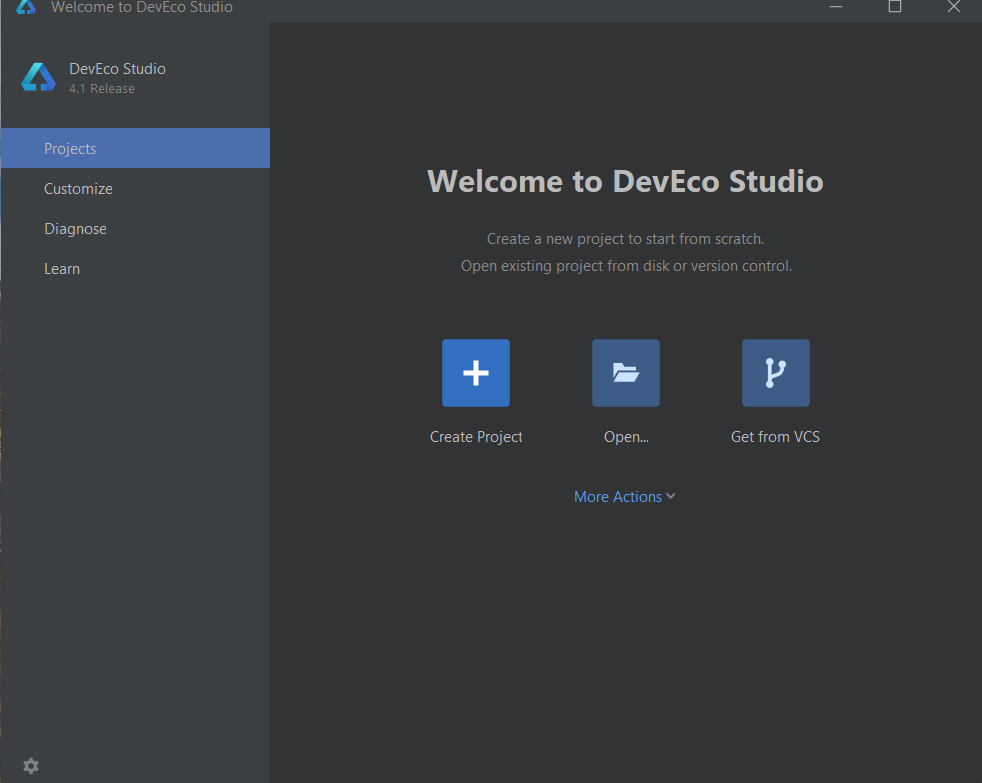
</div>

The **Create Project** window opens with template market provided by DevEco Studio.
<div style="text-align:center">
    
</div>

In DevEco Studio, a project template serves as a blueprint for building specific types of apps. It defines the project structure and essential files, providing starter code to help you get started quickly.

3. Make sure the `Application` tab is selected on the left bar, then choose `[OpenHarmony]Empty Ability` as project template and click `Next`.
<div style="text-align:center">
    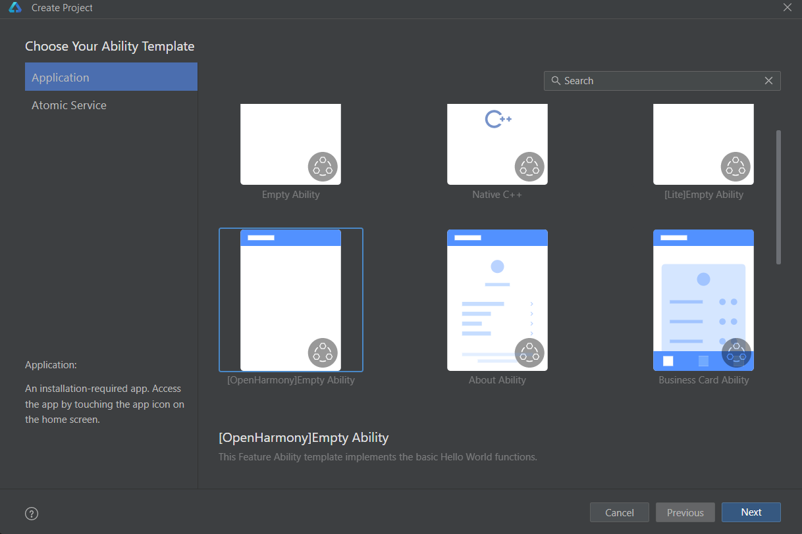
</div>

4. Configure your project with following information:  

- The **Project name** field is used to enter the name of your project.

- The **Bundle name** field represents the package name, which also serves as the default application ID. Keep it as default to maintain the file organization.

- The **Save location** field specifies where all project files are stored, you can leave it as default.  

- The **Compile SDK** specifies the API version used for compilation. By default, **API 11** is selected in our case, which also sets **ArkTS** as the development language.  

- Select **Stage** for **Model** and keep the default values for all other parameters.

>**Note:**
 If you plan to use **JavaScript**, select **API 8** instead. This will provide a language option where you can choose **JS**.

<div style="text-align:center">
    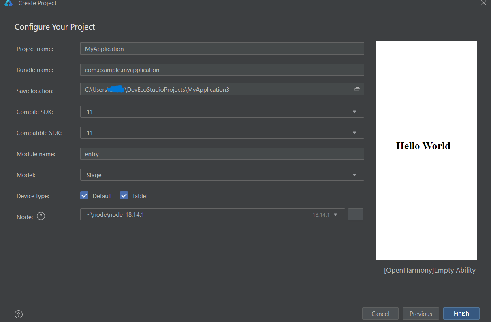
</div>  

5. Click `Finish` and wait for the project creation.

<div style="text-align:center">
    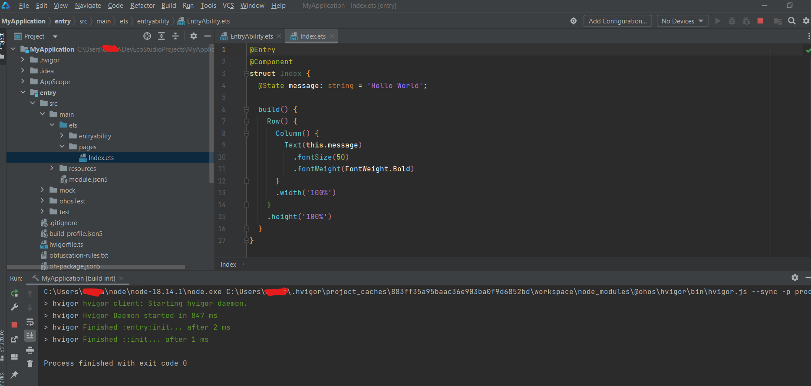
</div> 

6. Click **Previewer** on the right sidebar of DevEco Studio to view both the code and design simultaneously.

<div style="text-align:center">
    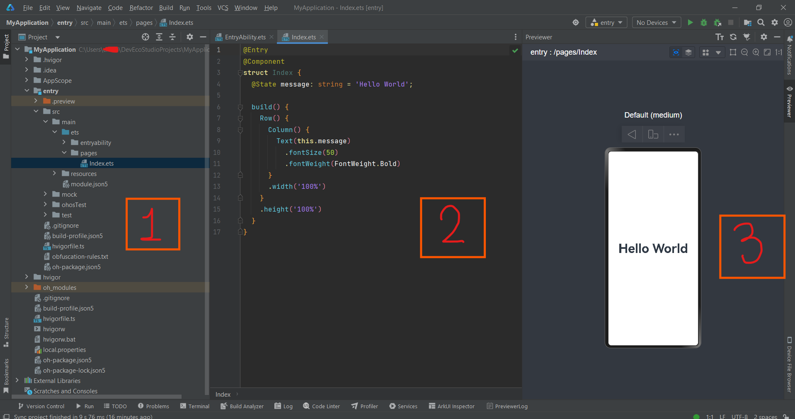
</div> 

- **Project View**(Part 1): Displays all files and folders in your project.  
- **Code View**(Part 2): The workspace for editing code.  
- **Design View**(Part 3): Allows you to preview your app’s design.


## Find project files

1. In DevEco Studio, take a look at the **Project** tab. The **Project** tab shows the actual file directory structure of the project as well as all project items and their dependencies (including SDKs and libraries)  
<div style="text-align:center">
    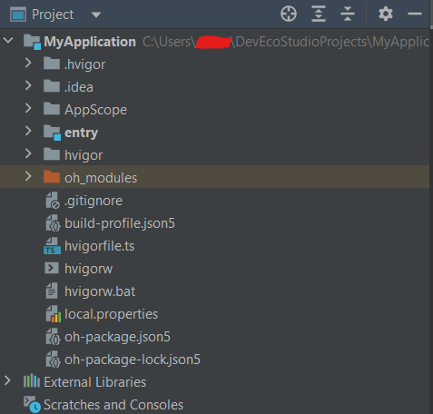
</div> 
<br>

2. Select **Project Files** from the drop-down menu. You can browse all the files in the project content root directory, but does not display external libraries and frameworks.
<div style="text-align:center">
    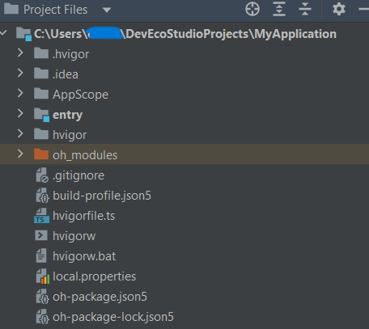
</div> 
<br>

3. If necessary, select **Open Files** to quickly jump between recently viewed files.
<div style="text-align:center">
    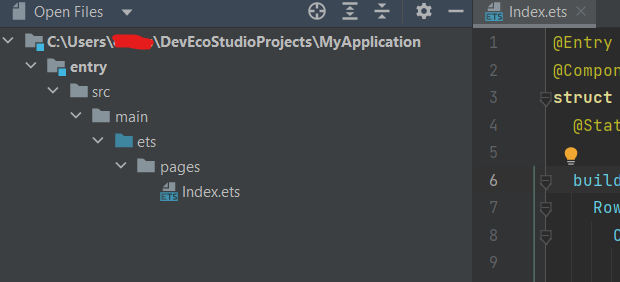
</div> 
<br>

4. Select **Ohos** from the drop-down menu. This optimized view clearly presents essential files required for development, making it easier for developers to quickly locate core code and resources related to application development.
<div style="text-align:center">
    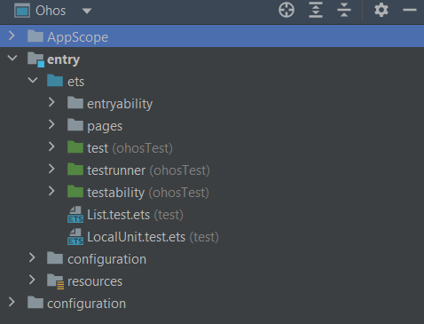
</div> 
<br>

For our application development, the **Ohos** view is usually the best choice, we will use **Ohos** tab in this course.

## Usage of Previewer  

To preview the UI display effect of a file in real-time using DevEco Studio's Previewer, click on the **Previewer** tab located on the right side of the DevEco Studio interface.   
During UI code development, if you add or remove UI components, simply save your changes by pressing **Ctrl+S** or click **Reload**. The Previewer will then immediately refresh to reflect the updated UI.
>**Note**:
For .ets file, Previewer only works with components which decorated with **@Entry** or **@Preview** decorator.
<div style="text-align:center">
    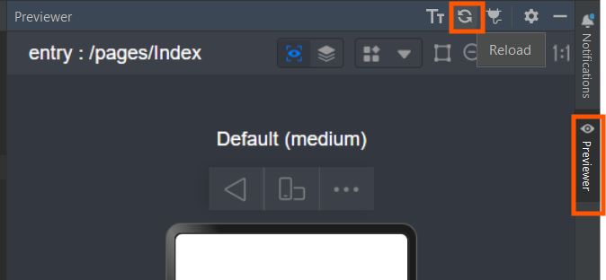
</div> 
<br>

DevEco Studio's **Previewer** offers several essential features to enhance the UI development experience:

- **Screen Rotation**: You can switch between portrait and landscape orientations by clicking the **Orientation** button within the Previewer. 
<div style="text-align:center">
    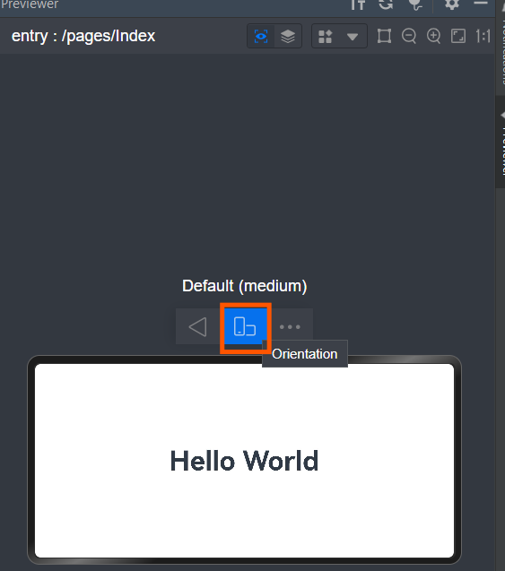
</div> 
<br>

- **Device Switching**: The Previewer allows you to switch between different device profiles to see how your application appears on various devices. 
<div style="text-align:center">
    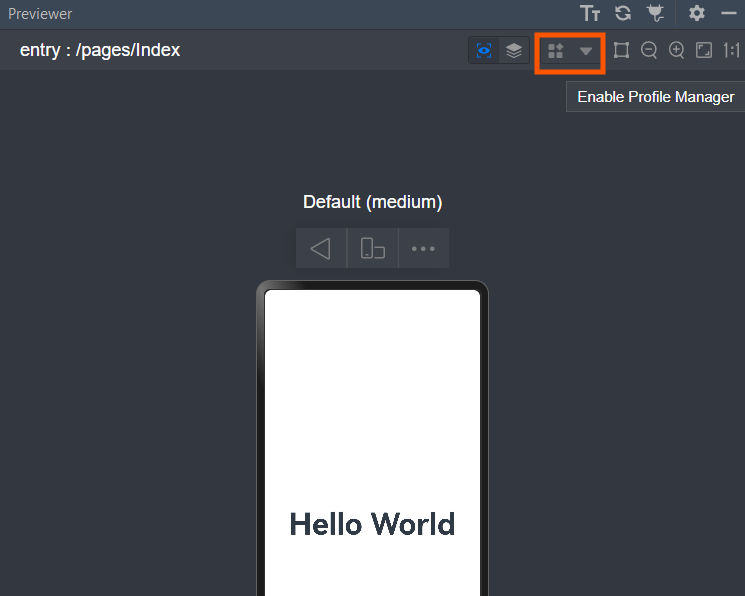
    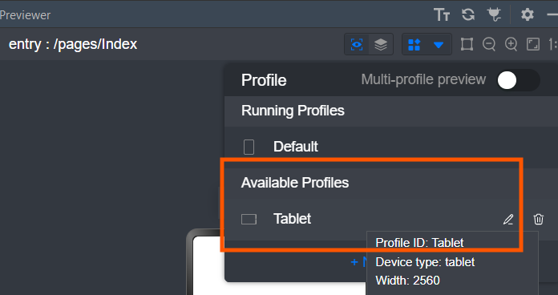
    
</div> 
<br>


- **Multi-Device Preview**: By enabling the multi-device preview feature, you can simultaneously view your application's UI across multiple devices.
<div style="text-align:center">
    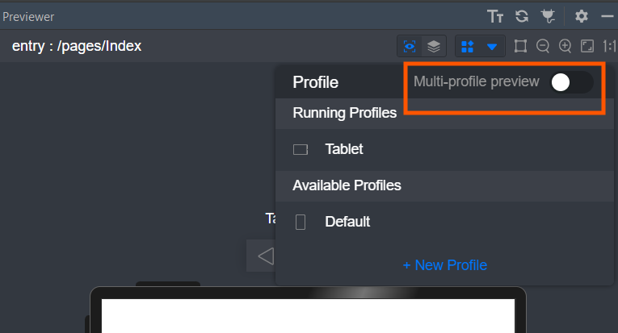
    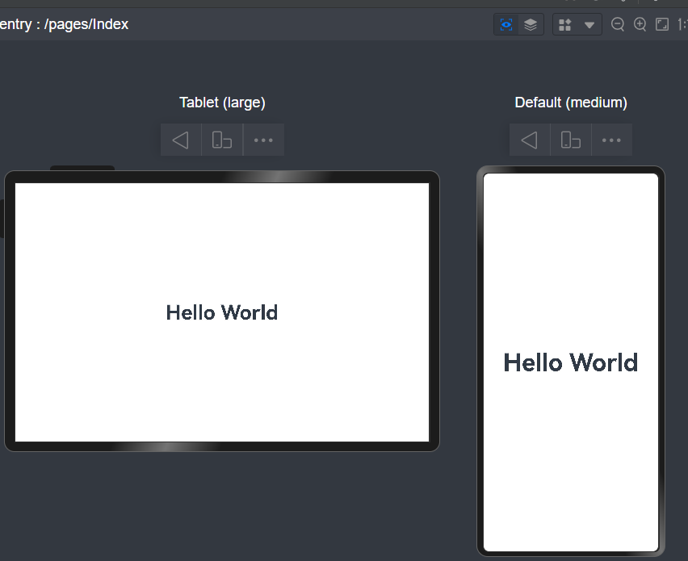
</div> 
<br>

- **Code Inspection**: ​DevEco Studio's **Inspector** feature enables bidirectional interaction between the `code editor`, `UI preview`, and `component tree`.  
<div style="text-align:center">
    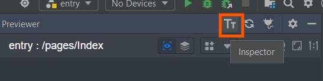
    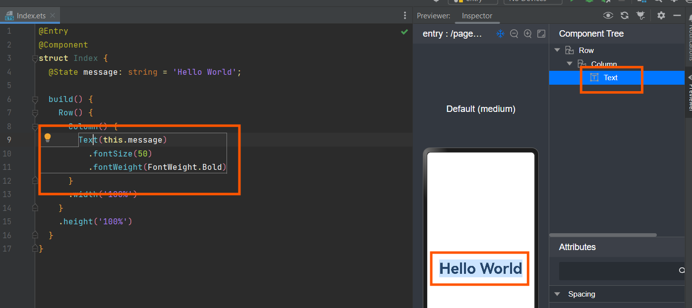
</div> 
<br>


These features collectively provide a comprehensive environment to visualize and fine-tune your application's user interface across different devices and orientations.

## Build the First Page
​Now that you're familiar with DevEco Studio, let's create a simple application that demonstrates page navigation.
### Use the `Text` Component
​After the project synchronization completes, navigate to `entry > ets > pages` in the **Ohos** window and open the `Index.ets` file. This file contains a Text component. The sample code in the `Index.ets` file is shown below:​
```typescript
// Index.ets
@Entry
@Component
struct Index {
  @State message: string = 'Hello World';

  build() {
    Row() {
      Column() {
        Text(this.message)
          .fontSize(50)
          .fontWeight(FontWeight.Bold)
      }
      .width('100%')
    }
    .height('100%')
  }
}
```
### Add a `Button` Component
On the `Index` page, add a **Button** component to handle user clicks and navigate to another page. The following sample code in `Index.ets` demonstrates this implementation:

```typescript
// Index.ets
@Entry
@Component
struct Index {
  @State message: string = 'Hello World';

  build() {
    Row() {
      Column() {
        Text(this.message)
          .fontSize(50)
          .fontWeight(FontWeight.Bold)
        // Add a button to respond to user clicks.
        Button() {
          Text('Next')
            .fontSize(30)
            .fontWeight(FontWeight.Bold)
        }
        .type(ButtonType.Capsule)
        .margin({
          top: 20
        })
        .backgroundColor('#0D9FFB')
        .width('40%')
        .height('5%')
      }
      .width('100%')
    }
    .height('100%')
  }
}
```
Now you can observe how the first page looks like in the `Previewer`
<div style="text-align:center">
    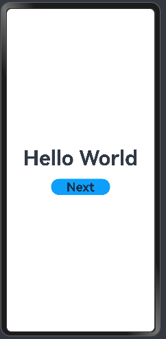
</div> 

## Build the Second Page  
### Create the Second Page
1. Right click `entry > ets > pages` folder, select `New` and choose `Page`.
<div style="text-align:center">
    
</div> 

2. Type 'SecondPage' as the new Page name. 
<div style="text-align:center">
    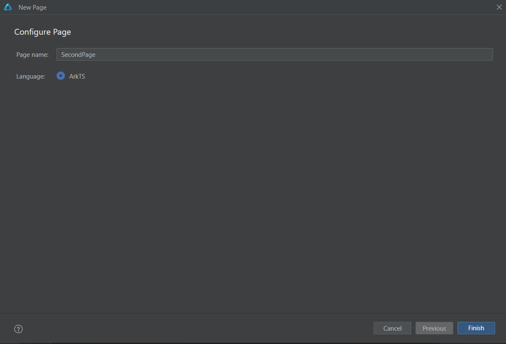
</div> 

SecondPage created.

Navigate to `entry > resources > base > profile`, open `main_pages.json` you will find the page routes was configured automatically.
```typescript
// main_pages.json
{
  "src": [
    "pages/Index",
    "pages/SecondPage"
  ]
}
```
>**Note:**
If you create the page in other methods, you have to manually configure the page routes in above path.

### Add `Text` and `Button` Components
Add **Text** and **Button** components with styled properties, using the first page as a reference. The sample code in `Second.ets` is shown below:
```typescript
// SecondPage.ets
@Entry
@Component
struct SecondPage {
  @State message: string = 'Second Page';

  build() {
    Row() {
      Column() {
        Text(this.message)
          .fontSize(50)
          .fontWeight(FontWeight.Bold)
        Button() {
          Text('Back')
            .fontSize(25)
            .fontWeight(FontWeight.Bold)
        }
        .type(ButtonType.Capsule)
        .margin({
          top: 20
        })
        .backgroundColor('#0D9FFB')
        .width('40%')
        .height('5%')
      }
      .width('100%')
    }
    .height('100%')
  }
}
```
You can observe how the second page looks like in the `Previewer`
<div style="text-align:center">
    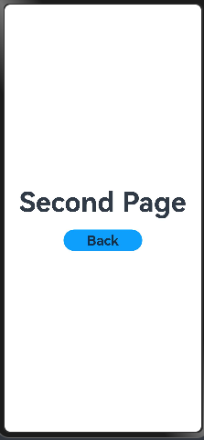
</div> 

## Implementing Page Redirection
You can achieve page navigation using the **page router**, which locates the target page based on its URL. To implement this, first import the router module and follow the steps below.  

To deliver better transition effects, use **Navigation**(Recommended).  

### Redirection from the first page to the second page
In the `Index.ets` file of the first page, bind the **onClick** event to the **Next** button, allowing users to navigate to the second page when clicked. The sample code in `Index.ets` is shown below:

```typescript
// Index.ets
// Import the router module.
import router from '@ohos.router';
import { BusinessError } from '@ohos.base';

@Entry
@Component
struct Index {
  @State message: string = 'Hello World';

  build() {
    Row() {
      Column() {
        Text(this.message)
          .fontSize(50)
          .fontWeight(FontWeight.Bold)
        // Add a button to respond to user clicks.
        Button() {
          Text('Next')
            .fontSize(30)
            .fontWeight(FontWeight.Bold)
        }
        .type(ButtonType.Capsule)
        .margin({
          top: 20
        })
        .backgroundColor('#0D9FFB')
        .width('40%')
        .height('5%')
        // Bind the onClick event to the Next button so that clicking the button redirects the user to the second page.
        .onClick(() => {
          console.info(`Succeeded in clicking the 'Next' button.`)
          // Go to the second page.
          router.pushUrl({ url: 'pages/SecondPage' }).then(() => {
            console.info('Succeeded in jumping to the second page.')
          }).catch((err: BusinessError) => {
            console.error(`Failed to jump to the second page.Code is ${err.code}, message is ${err.message}`)
          })
        })
      }
      .width('100%')
    }
    .height('100%')
  }
}
```
Click the `Next` button now and page will redirect to the `SecondPage`. You can also observe the printed information in console as well.
<div style="text-align:center">
    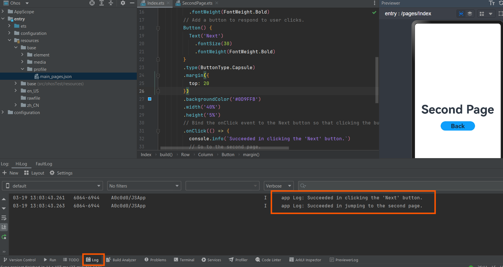
</div> 

### Redirection from the second page to the first page
In the `SecondPage.ets` file of the second page, bind the **onClick** event to the **Back** button, enabling users to navigate back to the first page when clicked. The sample code in `SecondPage.ets` is shown below:  
```typescript
// SecondPage.ets
// Import the router module.
import router from '@ohos.router';
import { BusinessError } from '@ohos.base';

@Entry
@Component
struct SecondPage {
  @State message: string = 'Hi there';

  build() {
    Row() {
      Column() {
        Text(this.message)
          .fontSize(50)
          .fontWeight(FontWeight.Bold)
        Button() {
          Text('Back')
            .fontSize(25)
            .fontWeight(FontWeight.Bold)
        }
        .type(ButtonType.Capsule)
        .margin({
          top: 20
        })
        .backgroundColor('#0D9FFB')
        .width('40%')
        .height('5%')
        // Bind the onClick event to the Back button so that clicking the button redirects the user back to the first page.
        .onClick(() => {
          console.info(`Succeeded in clicking the 'Back' button.`)
          try {
            // Return to the first page.
            router.back()
            console.info('Succeeded in returning to the first page.')
          } catch (err) {
            let code = (err as BusinessError).code;
            let message = (err as BusinessError).message;
            console.error(`Failed to return to the first page.Code is ${code}, message is ${message}`)
          }
        })
      }
      .width('100%')
    }
    .height('100%')
  }
}
```
Click the `Back` button on the page or the triangle icon on the Previewer, the page will redirect back to the `Index`. You can also observe the printed information in console as well.
<div style="text-align:center">
    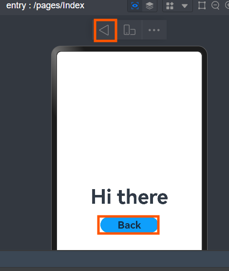
    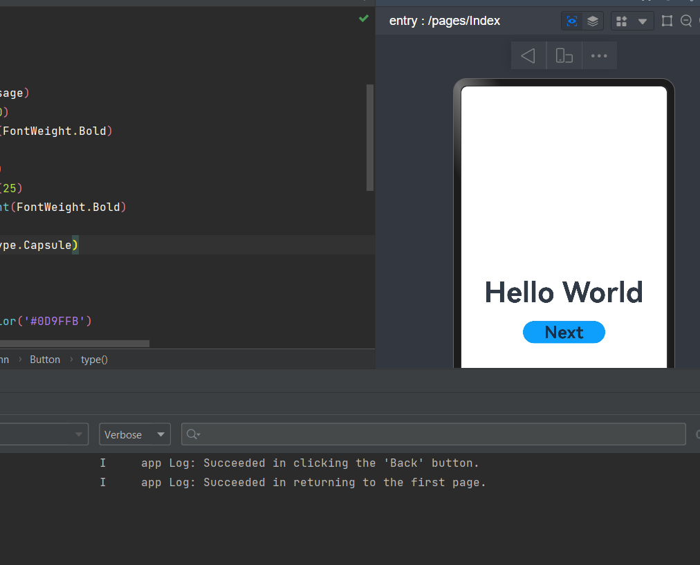
</div> 

## Running the Application on a Real Device
### Install HDC  
1. Find the [pipeline]((https://ci.openharmony.cn/workbench/cicd/dailybuild/dailylist)) whose name is ohos-sdk-full or ohos-sdk-public, click Download Link, and select Full Package.

>**Note:**
You can skip this part if you followed the procedure from [Environment Setup and Configuration](/application-development/environment-setup-config.md) tutorial. 

Use conditional filtering, such as selecting the project as openharmony, selecting the target branch OpenHarmony-4.1-Release, selecting a date from the previous month, or manually choosing a range.  
   
In the daily build or rolling build, find **ohos-sdk-full_4.1-Release**, and click on the download link to choose and download the full package, which includes Full-SDK for Windows and Linux.  (If daily build SDK is not compatible with your version of DevEco Studio, try to use rolling build SDK instead)  
  

2. Under `toolchain` folder, find `hdc.exe` and `libusb_shared.ddl`.
<div style="text-align:center">
    
</div> 

3. Create a folder called `hdc_bin`, you can create it wherever you like and put `hdc.exe` and `libusb_shared` into that folder.
<div style="text-align:center">
    
</div> 

4. Add **Environment Variable**
- Open `Settings` on Windows system, type `environment` to search `Edit the system environment variables` and click it.
<div style="text-align:center">
    
</div> 

- Make sure the `System Properties` window is under `Advanced` tab, click `Environment Variables...`
<div style="text-align:center">
    
</div> 

- Double click `Path` in `System variables` area. Click `New` on new pop-up window and paste your `hdc_bin` folder path.  
After that, click `OK` for all windows. 
<div style="text-align:center">
    
</div> 

- Check whether the HDC is running properly
You can open your `Command prompt` and type `hdc` to check.
<div style="text-align:center">
    
</div> 

### Use real machine to run application with USB  
1. Connect the development board(Here I used `HiHope HH-SCDAYU200 Development Kit`) running the OpenHarmony standard system to the computer and you can find the running device on the top part of the IDE.
<div style="text-align:center">
    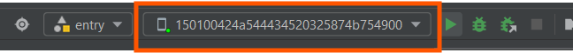
</div> 

2. Generate signature. 
- Click `Project Structure...` icon on the top-right corner of the IDE, Choose `Project > Signing Configs` and select `Automatically generate signature`. 
- Click `Apply` and wait until the automatic signing is complete.
<div style="text-align:center">
    
</div> 

- You can find signed signature in `configuration` folder and open `build-profile.json5` file.

<div style="text-align:center">
    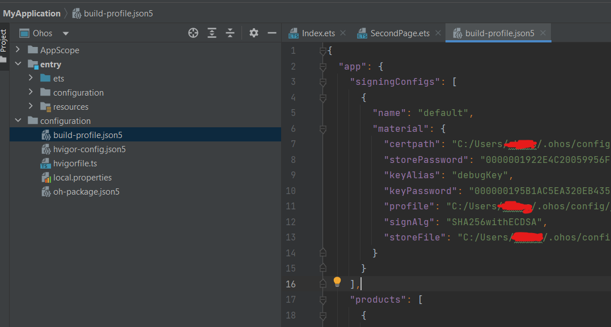
</div> 

3. Click `Run 'entry'` triangle button.
<div style="text-align:center">
    
</div> 

4. You can observe the application running on the board.
<div style="text-align:center">
    
</div> 

You learned about DevEco Studio and built your first Eclipse Oniro Application, congratulations!
