# Environment Setup Guide

Text from (https://github.com/frankplus/oh-app-development-docs/blob/master/Chapter_3/Dev%20Enviroment%20Setup%20Guide.md)  

This guide aims to help developer set up their own development environment.

**Content Table:**  
[System Requirement](#system-requirement)  

[IDE Installation](#ide-installation)  
   - [Get Package](#get-package)  
   - [Step by Step Installation](#step-by-step-installation)  

[Environment Configuration](#environment-configuration)  

[Full SDK & Public SDK](#full-sdk--public-sdk)  

[Developer Account](#developer-account)  

[Introduction to OHPM](#introduction-to-ohpm)  

[Common Issues and Solutions](#common-issues-and-solutions)  

# System Requirement  
For this tutorial, we use Windows system as example, it is recommended to meet the following requirements:

Operating system: Windows 10 64-bit

Memory: at least 8 GB

Hard disk: at least 100 GB

Resolution: at least 1280 x 800 pixels

# IDE Installation  
We are using **DevEco Studio** as the IDE  


## Get Package
You can install **DevEco Studio** from [here](https://contentcenter-vali-drcn.dbankcdn.cn/pvt_2/DeveloperAlliance_package_901_9/ee/v3/HqJ-6O2FQny86xtk_dg9HQ/devecostudio-windows-4.1.0.400.zip?HW-CC-KV=V1&HW-CC-Date=20240409T033730Z&HW-CC-Expire=315360000&HW-CC-Sign=BFA444BC43A041331E695AE2CFA9035A957AF107E06C97E793FD3D31D7096A0D) (Current download version is DevEco Studio 4.1) or you can visit the OpenHarmony [release notes](https://docs.openharmony.cn/pages/v4.1/zh-cn/release-notes/OpenHarmony-v4.1-release.md)  
If the **EN** version not available, try translating the page to English
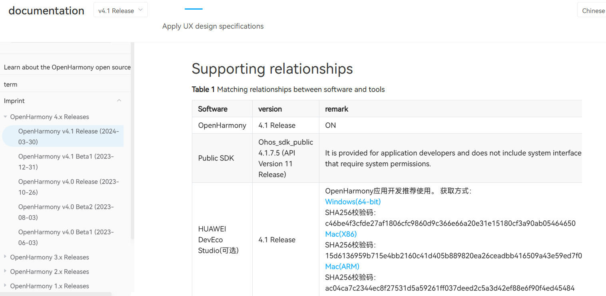


[Windows(64-bit)](https://contentcenter-vali-drcn.dbankcdn.cn/pvt_2/DeveloperAlliance_package_901_9/ee/v3/HqJ-6O2FQny86xtk_dg9HQ/devecostudio-windows-4.1.0.400.zip?HW-CC-KV=V1&HW-CC-Date=20240409T033730Z&HW-CC-Expire=315360000&HW-CC-Sign=BFA444BC43A041331E695AE2CFA9035A957AF107E06C97E793FD3D31D7096A0D)

SHA256：c46be4f3cfde27af1806cfc9860d9c366e66a20e31e15180cf3a90ab05464650

[Mac(X86)](https://contentcenter-vali-drcn.dbankcdn.cn/pvt_2/DeveloperAlliance_package_901_9/3b/v3/JgGp8n0bShOkm1MpBFJ73w/devecostudio-mac-4.1.0.400.zip?HW-CC-KV=V1&HW-CC-Date=20240409T034037Z&HW-CC-Expire=315360000&HW-CC-Sign=35C1F8B3FC19325EBBC32D8E11106DDB074A8ECC6BB3A77FF2EADBA2A8A223DA)

SHA256：15d6136959b715e4bb2160c41d405b889820ea26ceadbb416509a43e59ed7f09

[Mac(ARM)](https://contentcenter-vali-drcn.dbankcdn.cn/pvt_2/DeveloperAlliance_package_901_9/21/v3/D7Jy1StbTwSLUXaA20VrAw/devecostudio-mac-arm-4.1.0.400.zip?HW-CC-KV=V1&HW-CC-Date=20240409T034235Z&HW-CC-Expire=315360000&HW-CC-Sign=19598AAC650D2AB24CAC6DFDF0DBD312188FB0438A8233B7687E6ACDC43A51F8)

SHA256：ac04ca7c2344ec8f27531d5a59261ff037deed2c5a3d42ef88e6f90f4ed45484

## Step by Step Installation
After the download completes, extract the downloaded package and run `deveco-studio-xxxx.exe`. 

Keep clicking `next` until **Choose Install Location** procedure. 
Specify desired installtion path by clicking `Browse...` if necessary and click `next`.
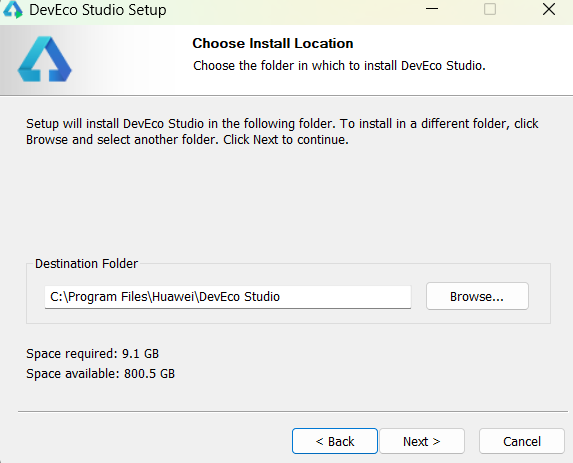  

>**Note:**
Ensure that you delete all files from the previous installation path before proceeding if it's not your first installation.
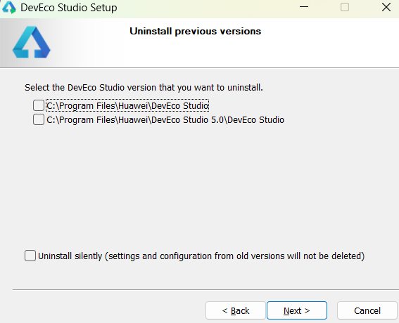  

In **Installation Options** procedure, select `Create Desktop Shortcut`
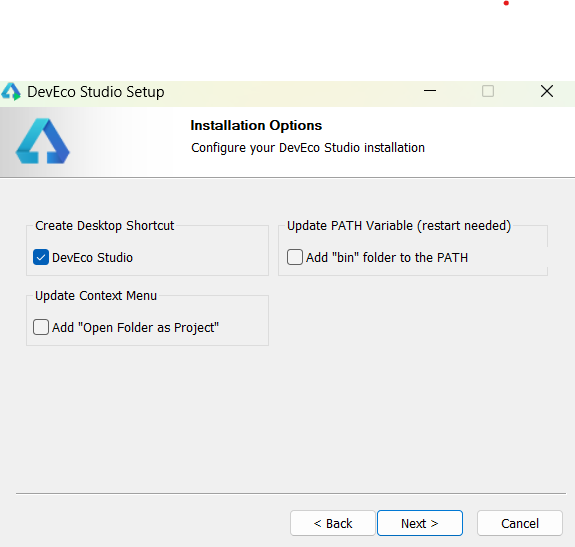  

In **Choose Start Menu Folder** procedure, keep default settings and click `install`.
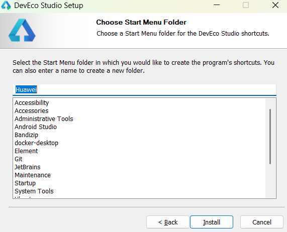  

The installation is finished.
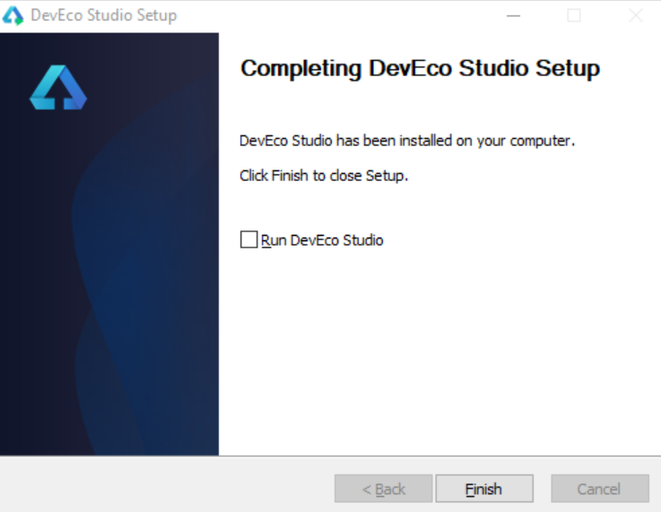  

# Environment Configuration  
Run `DevEco Studio` for the first time, configuation setting pages will appear.  
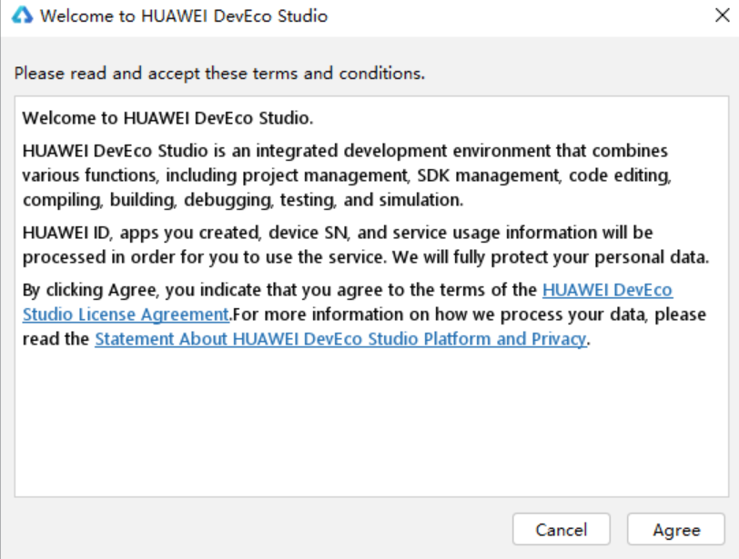  

Select `Do not import settings`
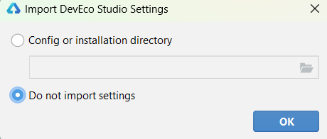  

On `Basic Setup` page, select install for **Node.js** and **Ohpm**.
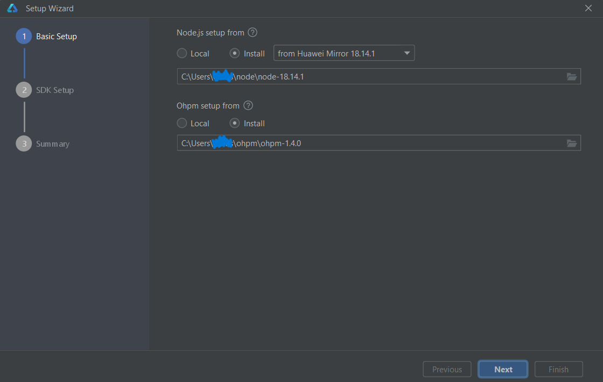  
Click **Next** to proceed to the SDK configuration page, and then set the SDK path to an appropriate location.
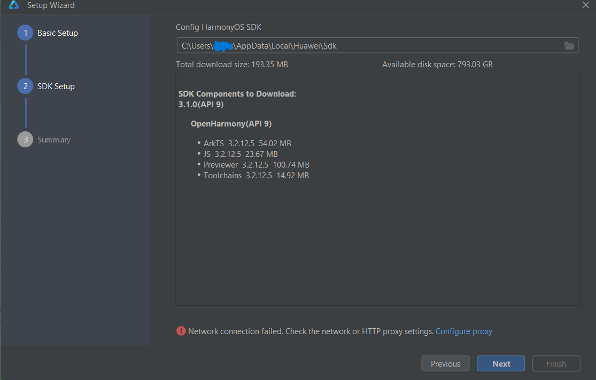  
Accept the License Agreement
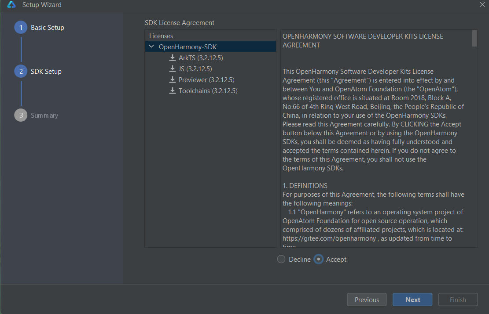  
Check the summary information and go next
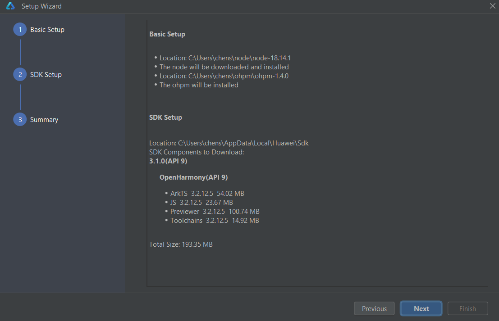  
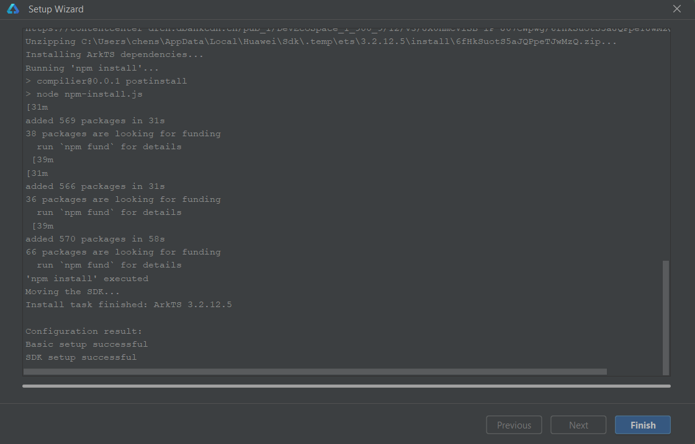  
Environment configuration is finished.
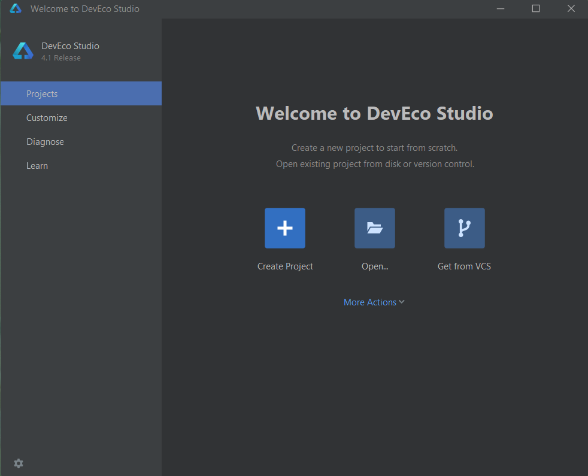  
>**Note:**
If you want to run application for OpenHarmony, you need to install revelent APIs as well. You can download public SDK from `DevEco Studio`->`Tool`->`SDK Manager`->`OpenHarmony`, select API and click `Apply` to download.
(If you downloaded DevEco Studio version is 4.1, choose API Version 11 for development.)
  


# Full SDK & Public SDK

There are two types of SDKs:

* Public-SDK: A toolkit provided for application development. It is available to download with DevEco Studio and does not include **high-permission APIs** required for system applications.  
* Full-SDK: A toolkit provided for OEM manufacturers to develop applications. It cannot be downloaded with DevEco Studio and includes **high-permission APIs** required for system applications.

## How to get the Full SDK?

### **Approach 1: From CICD pipeline (Recommended)**

#### Get the Full SDK

1. Obtain the latest OpenHarmony SDK from the OpenHarmony daily build pipline [Daily Build | OpenHarmony CI](https://ci.openharmony.cn/workbench/cicd/dailybuild/dailylist). The daily build pipeline builds system images, SDKs, etc.  
   
   Use conditional filtering, such as selecting the project as openharmony, selecting the target branch OpenHarmony-4.1-Release, selecting a date from the previous month, or manually choosing a range.  
   
   In the daily build or rolling build, find **ohos-sdk-full_4.1-Release**, and click on the download link to choose and download the full package, which includes Full-SDK for Windows and Linux.  (If daily build SDK is not compatible with your version of DevEco Studio, try to use rolling build SDK instead)  
  
 

| pipeline        | description                                                                                          | remark                                                                                                           |
| --------------- | ---------------------------------------------------------------------------------------------------- | ---------------------------------------------------------------------------------------------------------------- |
| ohos-sdk-public | The public SDK is available for Linux and Windows platforms                                          | It is provided for application developers and does not include system interfaces that require system permissions |
| mac-sdk-public  | The public SDK for macOS is available                                                                | It is provided for application developers and does not include system interfaces that require system permissions |
| ohos-sdk-full   | Applicable to Linux and Windows platforms. If you want to use system APIs, you need to use this SDK. | Available to OEMs, including system interfaces that require access to the system                                 |
| mac-sdk-full    | Full SDK for macOS. If you want to use system APIs, you need to use this SDK.                        | Available to OEMs, including system interfaces that require access to the system                                 |

2. Make sure that the downloaded SDK is the full SDK.  
   Check whether the downloaded file name contains "full-SDK."  
   Check if the API includes system APIs such as `@ohos.app.ability.abilityManager.d.ts`, `@ohos.app.form.formInfo.d.ts`, and `@ohos.bluetooth.d.ts` 

#### Replace the Full SDK

Take the replacement of the full SDK of DevEco Studio 4.1, API 11 on Windows OS as an example.

1. Backup and remove the local SDK:  
   Make sure to select OpenHarmony then navigate to the directory where the original SDK is installed.
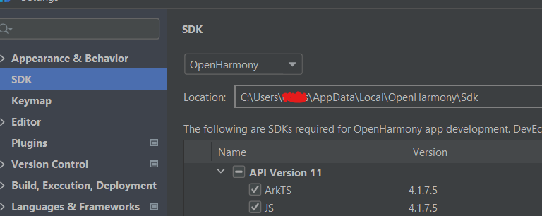  


Copy the entire SDK directory (e.g., 11) to another location on your system where you want to keep the backup.

Now you can remove the original SDK from its directory.

1. The SDK you have acquired needs to be recognized by DevEco Studio in order to be used. 
For example, with the daily build SDK: `version-Master_Version-OpenHarmony_4.1.7.7-20240830_034700-ohos-sdk-public_4.1-release.tar.gz`, the compressed file has the following directory structure. 
You can see that it contains SDK files for both Linux and Windows platforms. Each platform's SDK includes directories such as ets, js, native, previewer, and toolchains.
```
   └─version-Master_Version-OpenHarmony_4.1.7.7-20240830_034700-ohos-sdk-public_4.1-Release
   
       │  manifest\_tag.xml
       
       │
       
       └─ohos-sdk
       
           ├─linux
       
           │      ets-linux-x64-4.1.7.8-Release
       
           │      js-linux-x64-4.1.7.8-Release
       
           │      native-linux-x64-4.1.7.8-Release
       
           │      previewer-linux-x64-4.1.7.8-Release
       
           │      toolchains-linux-x64-4.1.7.8-Release
       
           │
       
           └─windows
       
                   ets-windows-x64-4.1.7.8-Release
       
                   js-windows-x64-4.1.7.8-Release
       
                   native-windows-x64-4.1.7.8-Release
       
                   previewer-windows-x64-4.1.7.8-Release
       
                   toolchains-windows-x64-4.1.7.8-Release
```
2. Create a new directory with the API version 11  as the file name in dir path: xxx\\Sdk\\ , unzip the compressed files  into this directory to form a structure below:
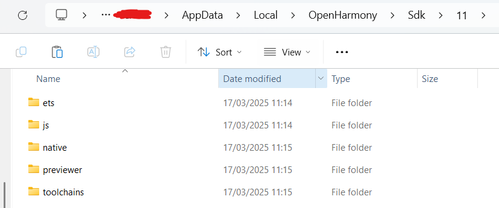  

3. Verify in the IDE:  
   Full API will be loaded in IDE and you can now rebuild the project.  
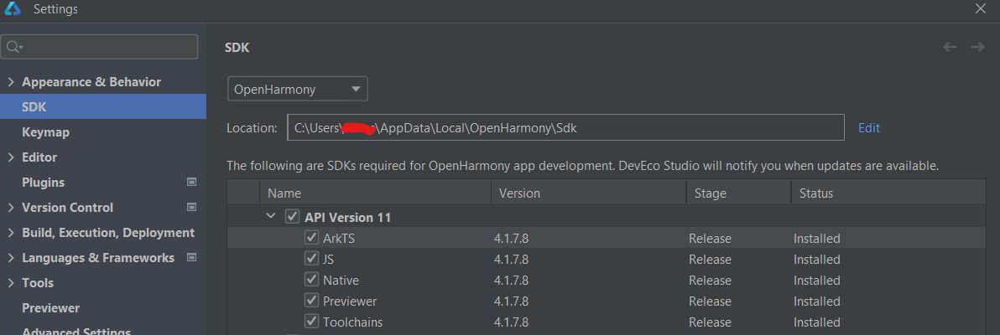  
Full SDK replacement tutorial finished.

### **Approach 2: From Compiled Source Files**

The Full-SDK is not available directly. It can be compiled from the source code of OpenHarmony and manually replaced in DevEco Studio. The method of replacing the SDK is the same as the one mentioned in [**Approach 1**](#approach-1-from-cicd-pipeline-recommended).

You can find the guide  of compilation of source code here: [How to compile Full SDK](https://gitee.com/openharmony/docs/blob/OpenHarmony-3.2-Release/zh-cn/application-dev/quick-start/full-sdk-compile-guide.md#%E7%BC%96%E8%AF%91full-sdk)

Please use translation tools if needed.

<div style="margin-top: 50px;"></div>

# Developer Account
>**Note:**
For application development, a developer account is not necessary. 

Introduction of Register and Identify Verification:  
[HUAWEI ID Registration and Verification | HUAWEI Developers](https://developer.huawei.com/consumer/en/doc/start/registration-and-verification-0000001053628148)

In simple terms, anyone can register for an individual developer account, whether they choose to verify their identity or not.  However, it's said that certain permissions require an identity verification with the identity document. 

According to information from the Huawei developer forum, verified developers gain access to more development resources, training materials, and market promotion. Moreover, only verified developers are allowed to publish applications.

Enterprise developers receive a broader range of services compared to individual developers. Here's a breakdown:

* Individual Developers: App Market, Themes, Product Management, Account, PUSH, New Game Pre-order, Interactive Comments, Social, HUAWEI HiAI, Watch App Market, etc.  

* Enterprise Developers: App Market, Themes, Initial Release, Payment, Game Packages, App Market Promotion, Product Management, Games, Account, PUSH, New Game Pre-order, Interactive Comments, Social, HUAWEI HiAI, Watch App Market, Sports & Health, Cloud Testing, Smart Home, etc.
<div style="margin-top: 50px;"></div> 

# Introduction to OHPM

OHPM (OpenHarmony Package Manager) is a package management system designed for OpenHarmony, providing access to third-party libraries and tools that enhance development efficiency and functionality within the OpenHarmony ecosystem. (Think of it as NPM in openharmony)

[OpenHarmony Third Party Repository](https://ohpm.openharmony.cn/\#/cn/home) 

Some examples of library：

1. **ohos\_axios**: A promise-based network request library that can run on Node.js and browsers, and is adapted for OpenHarmony.  
2. **socket.io**: A library for implementing low-latency, bidirectional communication between clients and servers, supporting WebSocket protocol.  
3. **mars**: A cross-platform network component library that provides solutions for long and short network connections.  
4. **httpclient**: An efficient HTTP client for OpenHarmony that supports various protocols and optimizes network transmission.

<div style="margin-top: 50px;"></div> 

# Common Issues and Solutions

## Installation Failure After Project Creation

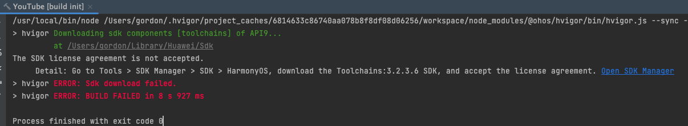  
There are a bunch of solutions on the forum but I simply tried switching the intranet to Internet.

## Cannot find the emulator of a phone device

entry\>src\>main\>module.json5 is the configuration file for the module, check deviceType, add 'phone' if the it is missing.

  


## Unable to find BMS Service when running on Emulator

Just wait for an extended period, or try clearing data of this device or creating a new device.

## Unstable USB connection, dev board not detected by IDE

solution worked for me:  

Change USB Power Management Settings

1. Search for and open *Device Manager*.  
2. Click to expand *Universal Serial Bus Controllers*.  
3. Right-click on *USB Root Hub* and select *Properties*.  
4. Uncheck *Power Management* and click *OK*.
<div>
    <figure >
        
    </figure>
</div>

## compileSdkVersion and releaseType of the app do not match the apiVersion and releaseType on the device

Reason: The compiled SDK version is higher than the actual device.

Solution:  
Step 1: Modify build\_profile.json5 under entry and set apiType to faMode.  
Step 2: Modify build\_profile.json5 under the project, change the compiled version to a lower version.  
Run again, and the problem will be resolved.  
   

## Install Failed

Have the device connected and detected by IDE, click on “run”, the IDE gives the error messages:   
"Install Failed : failed to install bundle. code: 9568289, error: install failed due to grant request permissions failed."  

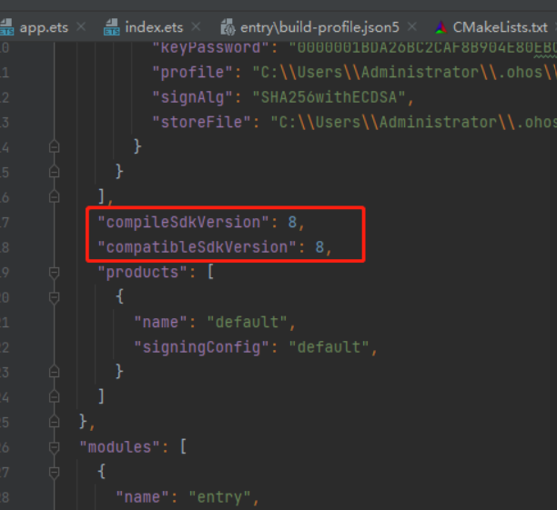

It should be a permission issue, and now we need to identify the permissions causing the problem.   

[This documentation](https://gitee.com/openharmony/resources/blob/master/systemres/main/config.json) lists all permissions and their levels in OpenHarmony. 

There are three types of permissions used in OpenHarmony for requests, ordered from low to high: normal, system\_basic, system\_core.

If the permission level is set to "availableLevel": "system\_basic", then you need to configure the acls field in the UnsignedReleasedProfileTemplate.json file and include the required high-level permissions in acls. The specific steps are as follows:

set the"profile" with p7b file generated from java \-c commands in build-profile.json5  


